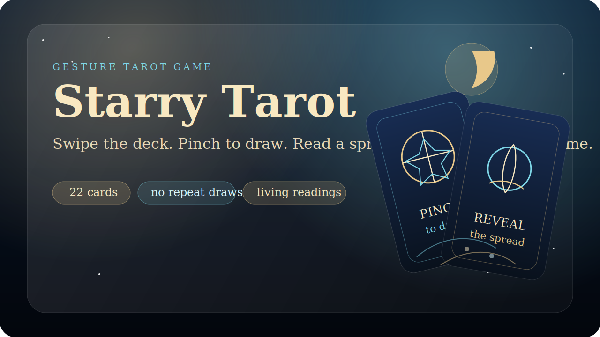
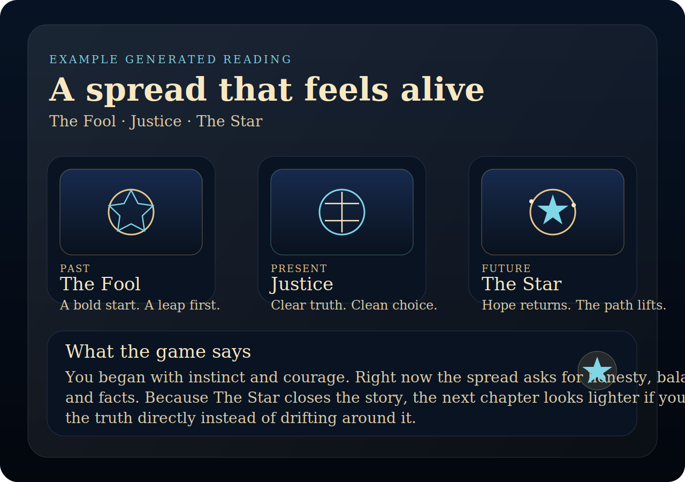
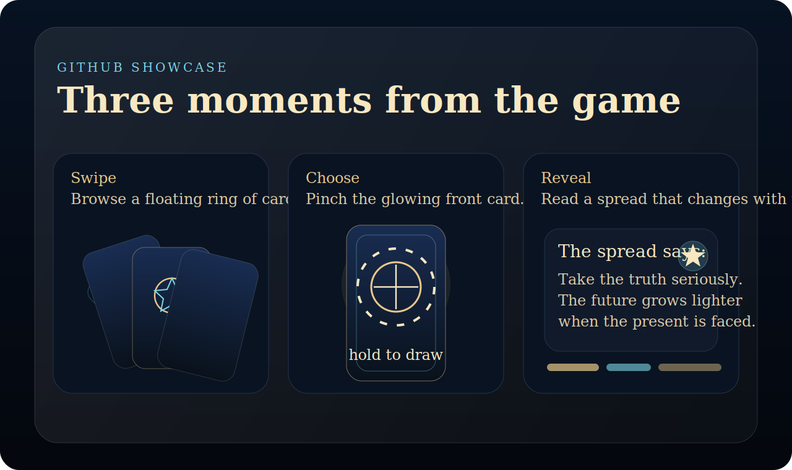

# Starry Tarot

Starry Tarot is a browser-based gesture control tarot game. Players browse a floating tarot deck with hand movement, pinch to draw three cards, and receive a reading generated from the exact spread they pulled.

It is built as a static web experience, so it is easy to run locally, easy to publish, and visually strong enough to work well as a portfolio-style GitHub project or a GitHub Pages site.

## Why this project is fun

- It turns webcam hand tracking into the core game mechanic
- It uses a larger tarot deck with no repeated cards in one reading
- It generates readable, spread-specific interpretations instead of repeating one fixed fortune
- It supports both general readings and romance readings with different framing
- It presents tarot in a way that feels stylish and imaginative without becoming unreadable

## Experience Snapshot



## A quick look



## Story of the experience

The player enters a celestial reading room, chooses a reading mode, and rotates through a ring of cards using hand movement. A glowing front card can be selected by holding a pinch. After three draws, the interface turns into a richly formatted reading panel with:

- a short introduction for each card
- a position-based interpretation for each card in the spread
- a multi-paragraph reading written from the actual combination
- a practical takeaway that sounds human instead of overly mysterious
- a reflection prompt that invites the player to continue the story

## Example readings the game can generate

### Example 1: Growth after honesty

`The Fool -> Justice -> The Star`

> This spread reads like a clear sequence instead of a vague omen. The Fool shows that the story began with openness and risk. Justice says the present moment now depends on clarity, accountability, and facts instead of wishful thinking. Because The Star closes the spread, the message is encouraging: when the truth is faced directly, the future looks more healing than heavy.

### Example 2: Romance with real potential

`Strength -> The Lovers -> The Sun`

> The relationship message here is grounded rather than dreamy. Strength shows a gentle but steady emotional foundation, The Lovers brings honest choice and alignment into focus, and The Sun suggests a future shaped by openness, warmth, and sincerity. In plain language, this is the kind of spread that says love grows best when both people stop guessing and start showing up clearly.

### Example 3: A warning not to avoid the issue

`The Moon -> The Devil -> Judgement`

> This combination suggests confusion first, then an unhealthy attachment or loop, and finally a wake-up call that cannot be postponed much longer. The cards are not saying everything is doomed. They are saying the situation improves only when the unhealthy pattern is named clearly and acted on with honesty.

## Controls

1. Open the page in a browser and allow camera access.
2. Choose `General Reading` or `Romance Reading`.
3. Move your hand left or right to rotate the deck.
4. Hold a pinch over the glowing front card to select it.
5. Draw three cards.
6. Read the generated result and reflection prompt.

## Run locally from the terminal

This is a static site, so there is no build step.

```bash
cd ~/Desktop/StarryTarot
python3 -m http.server 8000
```

Then open:

```text
http://localhost:8000
```

Allow camera access when the browser asks.

## Host it on a simple local server

To expose it to other devices on the same network:

```bash
cd ~/Desktop/StarryTarot
python3 -m http.server 8000 --bind 0.0.0.0
```

Then open:

```text
http://YOUR_COMPUTER_IP:8000
```

## Publish as GitHub Pages

Because the project is plain `HTML`, `CSS`, and `JavaScript`, it can be deployed directly with GitHub Pages.

- Push the repository to GitHub
- In repository settings, enable GitHub Pages
- Choose the root of the default branch as the publish source
- Open the generated Pages URL over HTTPS so webcam access works correctly

## Project structure

- `index.html`: app layout and reading panels
- `style.css`: theme system, menu, gameplay HUD, and reveal screen styling
- `script.js`: hand tracking logic, tarot deck data, draw flow, and reading generation
- `assets/`: GitHub showcase visuals used by the README

## Notes

- `localhost` usually works well for webcam permissions during local development.
- The project currently uses CDN-hosted MediaPipe scripts and remote tarot images, so an internet connection is still required.
- If you want a fully offline version later, the next good step would be bundling local assets for the deck and script dependencies.
